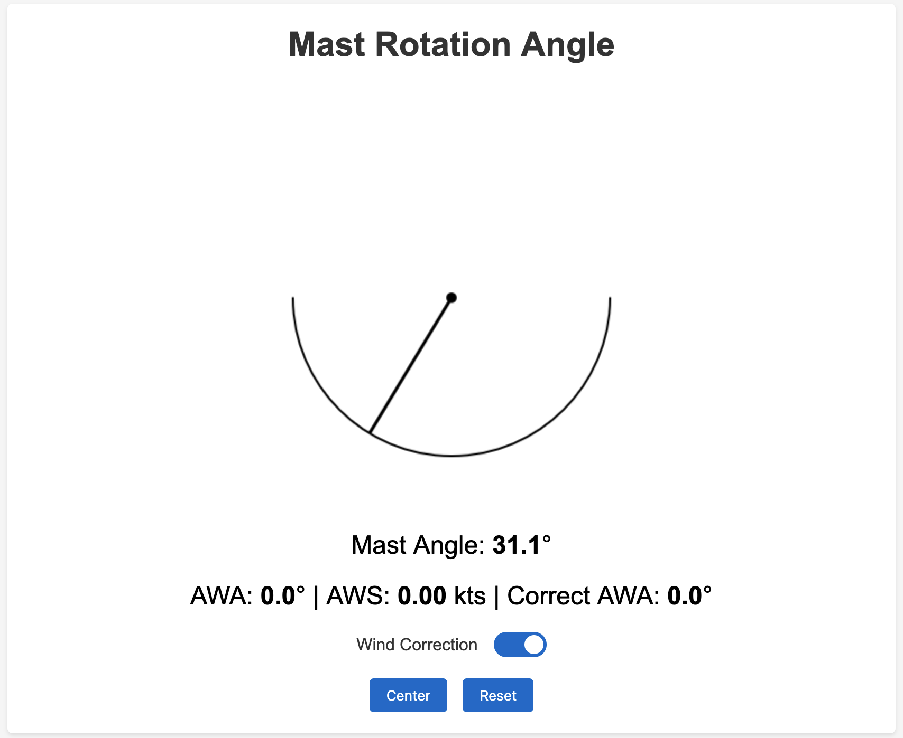
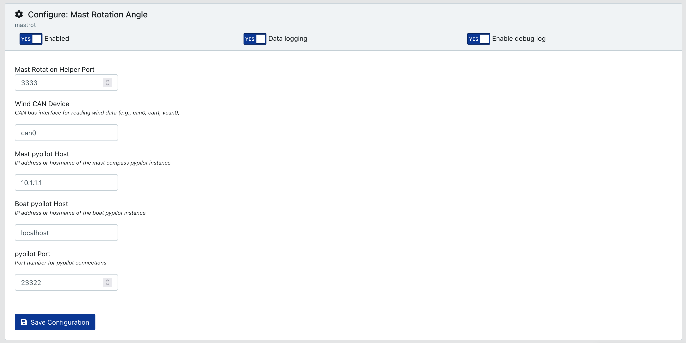

# SignalK Mast Rotation Plugin

A SignalK plugin for monitoring mast rotation angle and correcting masthead AWA. This plugin reads wind data from the N2K bus, reads magnetic heading of the boat from an electronic compass/pypilot, and magnetic heading of the mast from mast-mounted compass/pypilot. It uses the difference in headings to calculate a correction for AWA, and sends the corrected AWA to SK, where the SK-to-N2K plugin transmits the corrected AWA on the CAN bus (for Garmin instruments, a different CAN bus).



1. On your SignalK server:
``` 
    cd .signalk
    npm install https://github.com/wjquigs11/signalk-mast-rotation
```

2. Install and enable the signalk-to-nmea2000 plugin from the App Store, and check the box for Wind (130306).

3. Install pypilot.

I am currently using a fork of pypilot on the mast compass: https://github.com/wjquigs11/pypilot-mastcompass
The pypilot master does not have a way of disabling zeroconf, so the mast compass always attempts to connect to a SignalK server, which can result in invalid heading. The fork disables zeroconf and only connects to the specified SK server in the ~/.pypilot/pypilot.conf file.

The IMUs are, for the most part, self-calibrating and calibration improves with time on the boat. Follow pypilot calibration instructions if you are mounting in a non-typical orientation (for example, the mast compass mounted vertically on the mast instead of horizontally on the rotation arm).

Once the IMU/compasses have been installed and calibrated (at minimum, by sailing/motoring in several circles), align the mast on centerline and press the "Center" button in the plugin. This typically only needs to be done once. You can enable/disable correction with the toggle.

I use Raspberry Pi with ICM‑20948 IMU module. SignalK runs on a Pi4 or 5, and the mast compass uses a Pi Zero 2W. I can provide compasses if needed. The plugin can also work with commercial compasses (Garmin Steadycast, B&G Precision-9) with modification.




